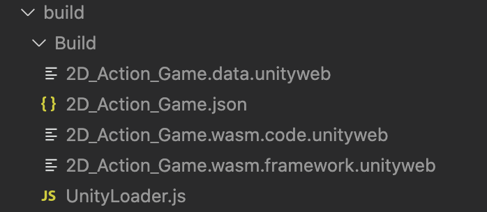

## 目的

UnityをWebGL形式で出力し、react-unity-webglライブラリを使ってReact上で動かす。
> 完成図: [2Dアクションゲームサンプル](https://kudohayatoblog.com/blog/reactUnity_sample){:target="_blank"}

## 使用環境

- React (17.0.1)
- Unity (2019.419f1)
- react-unity-webgl

## 手順

1. ### react-unity-webglインストール

    Unityのバージョンに対応するパッケージをダウンロード<br>
    ※Unityのバージョンは、【HELP → Check for Updates】もしくは【Unity Hub】から確認できます。

    ```
    $ npm install react-unity-webgl@8.x  # For Unity 2020 and 2021
    $ npm install react-unity-webgl@7.x  # For Unity 2018 and 2019 (LTS)
    $ npm install react-unity-webgl@6.x  # For Unity 2017 (LTS)
    $ npm install react-unity-webgl@5.x  # For Unity 5.6 (LTS)
    ```
    > 参考: [公式GitHub](https://github.com/elraccoone/react-unity-webgl){:target="_blank"}

2. ### UnityをWebGL形式でビルド

    * File → Build Settings からビルドページを開く
    * Platformから「WebGL」を選択し、Switch Platformを押す。
    * ビルド対象シーンを選択し、Build実行
    <br>
    > 参考: [【unity】WebGLビルド方法 - naichi's lab](https://blog.naichilab.com/entry/2017/04/29/125527){:target="_blank"}

    ビルドされたディレクトリから、「Build」ディレクトリを確認してください。<br>
    画像のような構造になっているかと思います。<br>
    このBuildディレクトリを、Reactプロジェクトのpublicフォルダーに置いてください。<br>

    

3. ### React側でUnityオブジェクトの作成

    UnityWebGLライブラリからUnityおよびUnityContentクラスをインポート、<br>
    新しいコンテンツオブジェクトを作成し、レンダリング関数で割り当てます。

    ```javascript
    import React from "react";
    import Unity, { UnityContent } from "react-unity-webgl";

    const unityContent = new UnityContent(
        "/Build/2D_Action_Game.json",
        "/Build/UnityLoader.js",
    );

    export const Game = () => {
        return <Unity unityContent={unityContent} />;
    };
    ```

## 終わり

ここまでお疲れ様でした。<br>
ReactでUnityを扱えるって燃えませんか？私は燃えました。<br>
便利なパッケージを作ってくれた方に感謝です！