## 目的

Google Calendar API: Push Notificationsを使用し、グーグルカレンダーの更新をwebhookで取得する。

## 使用環境

- Laravel (8.25.0)
- PHP (8.0.1)
- google/apiclient (2.0)
- Google Calendar API: Push Notifications

## 準備

- httpsサーバー(自己証明書は不可)
- Googleカレンダーアカウント


## 手順

1. ### Google Calendar API の設定

    [Google API コンソール](https://console.cloud.google.com/apis)へアクセスし、
    Google Calendar API 詳細ページの「有効にする」をクリックしてください。

    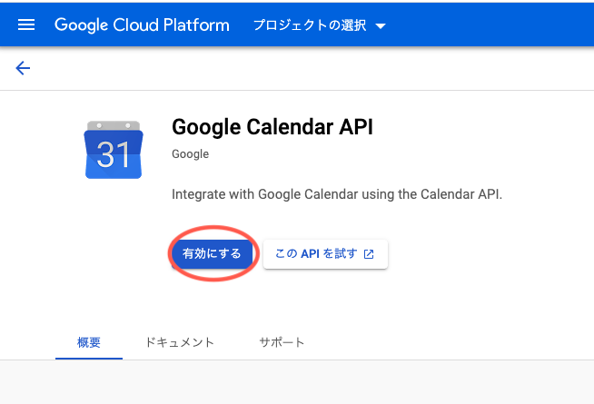

    有効にしたら、[Google API コンソール](https://console.cloud.google.com/apis)左側の「認証情報」から
    「認証情報を作成」をクリックし、「ウィザードで選択」を選択してください。

    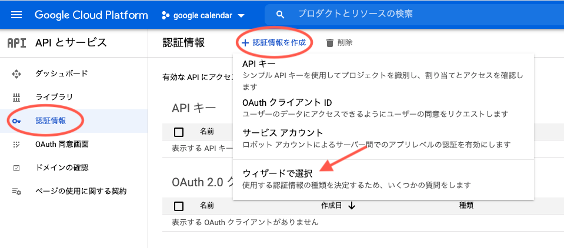

    認証情報の入力フォームが表示されるので、以下の内容で認証情報を選択し「必要な認証」をクリックします。

    |  項目名  |  入力  |
    | ---- | ---- |
    |  使用するAPI  |  : Google Calendar API  |
    |  APIを呼び出す場所  |  : ウェブサーバー  |
    |  アクセスするデータの種類  |  : アプリケーション  |
    |  App Engine または（以下略）  |  : いいえ、使用しません  |

    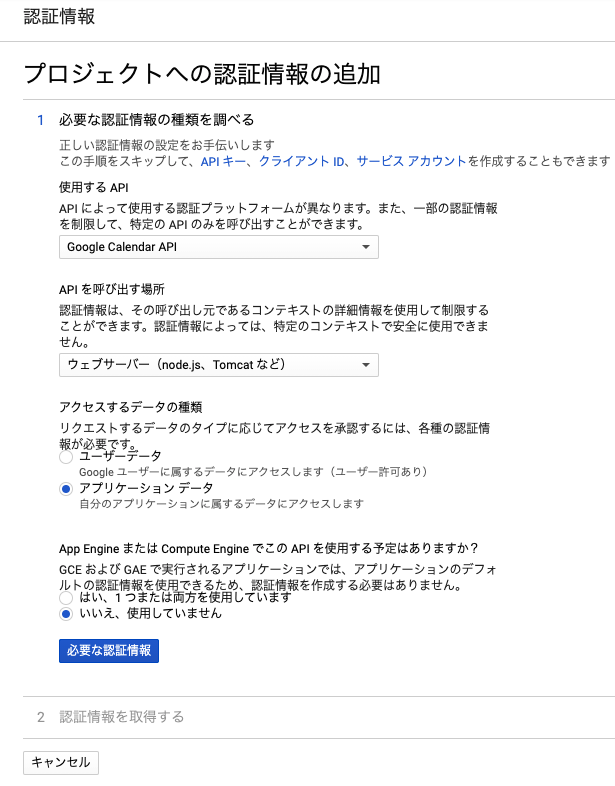

    クリックしたら画像のようなページに移るので、そこで「新しいサービスアカウントの作成」をクリックします。<br>
    (既に他のアカウントが作成追加されている場合、アカウントリストが表示されます。)<br>
    移動後、ページ上部の「サービスアカウントを作成」をクリックします。

    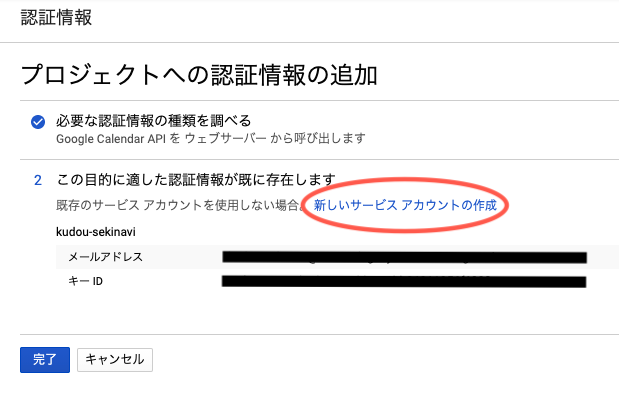

    サービスアカウントの詳細を入力するフォームが表示されるので、それぞれ入力し「作成を」クリックします。

    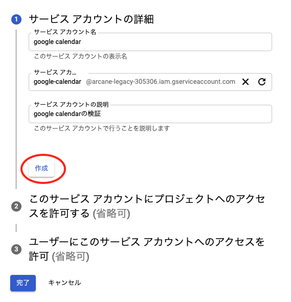

    サービスアカウントが作成されると、権限の設定画面が表示されるので、権限の選択をしてください。<br>
    (ここは任意ですが、例としてオーナーを選択しています。)<br>
    権限の選択をしたら「続行」をクリックします。

    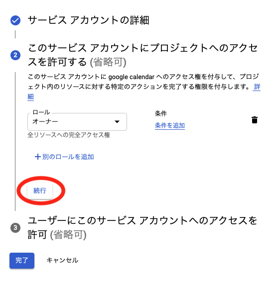

    次にアカウントへのアクセスを許可する設定画面が表示されますが、ここは省略します。<br>
    空白の状態で「完了」をクリックします。

    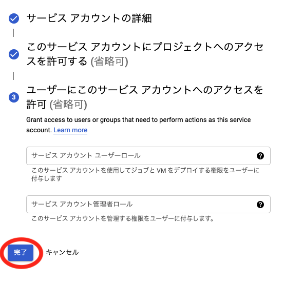

    サービスアカウントの設定が完了すると、サービスアカウントがリスト表示されているページに移ります。
    そこから先ほど作成したアカウントの「操作」をクリックし、「キーを作成」を選択してください。

    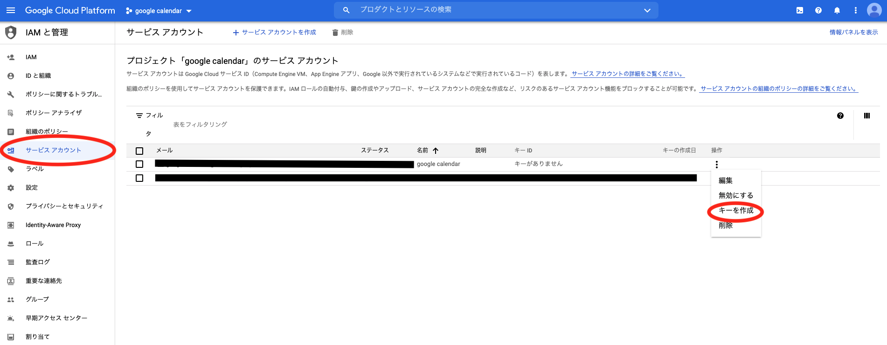

    秘密鍵をファイル形式で作成します。<br>
    キーのタイプをJSONにして「作成」をクリックしてください。<br>
    jsonファイルがダウンロードされますので、そちらをLaravelの/storageフォルダーに保存します。<br>
    (保存場所は任意ですが、Gitを利用する場合、監視対象外のフォルダーを選択してください。)

    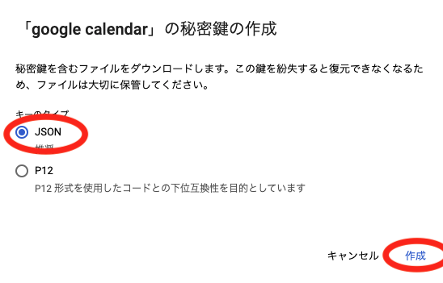

2. ### Googleカレンダーの設定

    作成したサービスアカウントがGoogleカレンダーにアクセスできるように設定をします。<br>
    [Googleカレンダー](https://calendar.google.com)右上の歯車マークをクリックし「設定」をクリックします。

    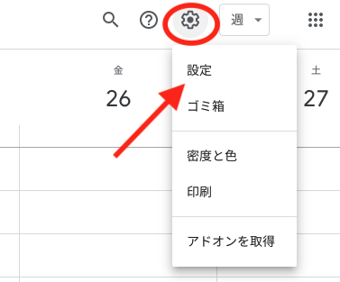

    監視したいカレンダーアカウントをクリックします。

    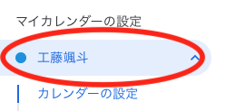

    ページ移動後、「特定のユーザーとの共有」のフォームに先ほど作成したサービスアカウントのメールアドレスを入力し、権限を「変更および共有の管理権限」に変更します。

    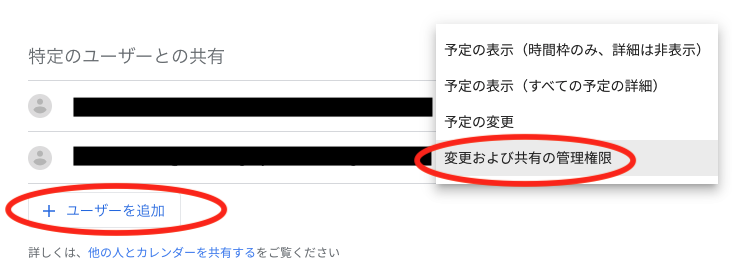

    変更したら、少し下にある「カレンダーの結合」からカレンダーIDをコピーしてください。<br>
    (コピーしたら.envファイルに追加してください。後で使用します。)

    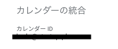

3. ### Laravelの実装

    [Google Calendar API: Push Notifications](https://developers.google.com/calendar/v3/push)の実装に入ります。<br>
    ※ドメイン登録は済んでいる体で解説します。<br>
    (登録が済んでいない場合は[GCPコンソール ](https://console.cloud.google.com/apis)の「ドメインの確認」からドメインを追加してください。)

    #### 通知チャンネルの作成
    [公式ドキュメント](https://developers.google.com/calendar/v3/push)ではPOSTリクエストしチャンネルを作成していますが、
    今回は[phpクライアントライブラリ](https://developers.google.com/resources/api-libraries/documentation/calendar/v3/php/latest/class-Google_Service_Calendar.html)で実装します。<br>
    まず、Google Clientを作成するため、「Google APIs Client Library for PHP」をインストールします。

    ```
    composer require google/apiclient:^2.0
    ```

    インストールしたら、storage配下に保存したjsonファイルを元に、Google Clientオブジェクトを生成するメソッドを実装します。

    ```php
    //Google Clientオブジェクトの作成
    public function getGoogleClient(){
        $client = new Google_Client();
        $client->setScopes(Google_Service_Calendar::CALENDAR_READONLY); //スコープの設定
        $client->setAuthConfig(storage_path('google calendar-0af51293112b.json'));  //storage配下に認証ファイルを設置
        return $client;
    }
    ```

    次にGoogleカレンダーを監視するチャンネルを生成するメソッドを実装します。<br>
    チャンネルの作成には[Google_Service_Calendar_Channel](https://developers.google.com/resources/api-libraries/documentation/calendar/v3/php/latest/class-Google_Service_Calendar_Channel.html)
    クラスを使用します。<br>
    - $calendar_id はGoogleカレンダーから取得したカレンダーIDです。
    - setId: チャンネルIDに設定した値は、作成したチャンネルで受信する全ての通知メッセージのHTTPヘッダーにエコーバックされます。
    - setToken: チャンネルトークンは任意で、設定しなくても大丈夫です。
    - setType: 「web_hook」を指定してください。
    - setAddress: 通知を受け取るURLを指定してください。

    ```php
    //チャンネル作成
    public function create_channel(Request $request){
        $calendar_id = Config::get('webpush.Calendar_ID');  //goole calender ID
        try {
            $service = new Google_Service_Calendar($this->getGoogleClient());
            $channel = new Google_Service_Calendar_Channel($this->getGoogleClient());
            $channel->setId('チャンネルID');
            $channel->setToken('チャンネルトークン');
            $channel->setType('web_hook');  //固定
            $channel->setAddress('受信URL');
            $watchEvent = $service->events->watch($calendar_id,$channel);
            return;
        } catch (Exception $e) {
            Log::debug($e->getMessage());
        }
    }
    ```

    チャンネルが作成されルト、次のようなJSON形式のレスポンスが返ってきます。<br>
    id と resourceUri はチャンネル削除時に使うため、メモしてください。

    ```json
    {
        "address": "",
        "expiration": "1614591011000",
        "id": "test",
        "kind": "api#channel",
        "params": "",
        "payload": "",
        "resourceId": "WX3s-QCWr5exN6K***********",
        "resourceUri": "https://www.googleapis.com/calendar/v3/calendars/{監視対象のカレンダー ID}/events?maxResults=250\u0026alt=json",
        "token": "test",
        "type": "",
    }
    ```

    チャンネルを作成したら、実際にGoogleカレンダーに予定を追加もしくは削除をしてみてください。正しく作られていれば、指定した受信URLにヘッダー情報が送られてきます。<br>
    (受信できない場合、Laravelのcsrf認証で弾かれている可能性があります。app/Http/Kernel.phpの「\App\Http\Middleware\VerifyCsrfToken::class」を無効化して試してみてください。)
    
    ```php
    //webhook受信
    public function index(Request $request){
        Log::debug($request->header()); //ヘッダーを取得
    }
    ```

    #### 通知チャンネルの削除

    チャンネルの削除は、チャンネル作成時に返されたチャンネルIDとリソースIDを使用します。

    ```php
    //チャンネル削除
    public function delete_channel(Request $request){
        try {
            $service = new Google_Service_Calendar($this->getGoogleClient());
            $channel = new Google_Service_Calendar_Channel($this->getGoogleClient());            
            $channel->setId('チャンネルID');
            $channel->setResourceId('リソースID');
            $watchEvent = $service->channels->stop($channel);
            return;
        } catch (Exception $e) {
            Log::debug($e->getMessage());
        }
    }
    ```

## 終わり

ここまでお疲れ様でした。<br>
今回はGoogle Calendar API について記事にしましたが、いかがだったでしょうか？<br>
個人的には、さすがGoogleと思えるクオリティでしたが、もう少しドキュメント内容を増やしてほしかったです(笑)<br>
記事の内容については、大部分を省略して書きましたので、不明点があればご連絡ください。分かる範囲でお答えします。