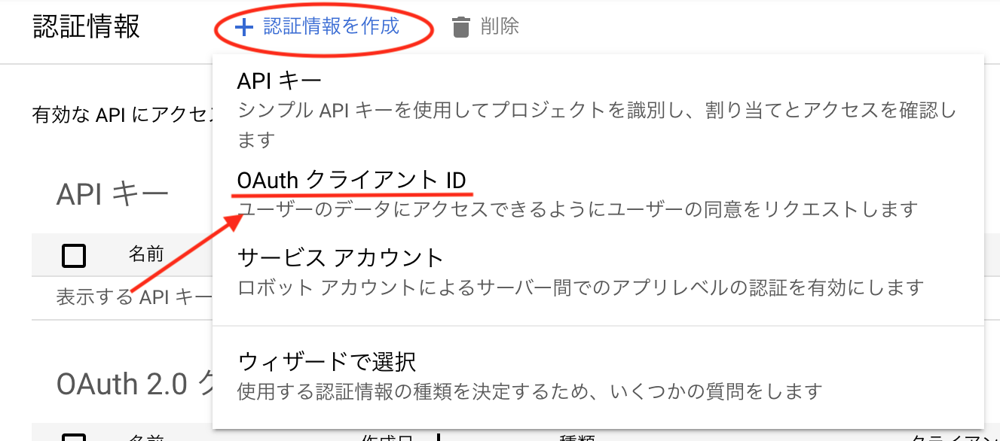
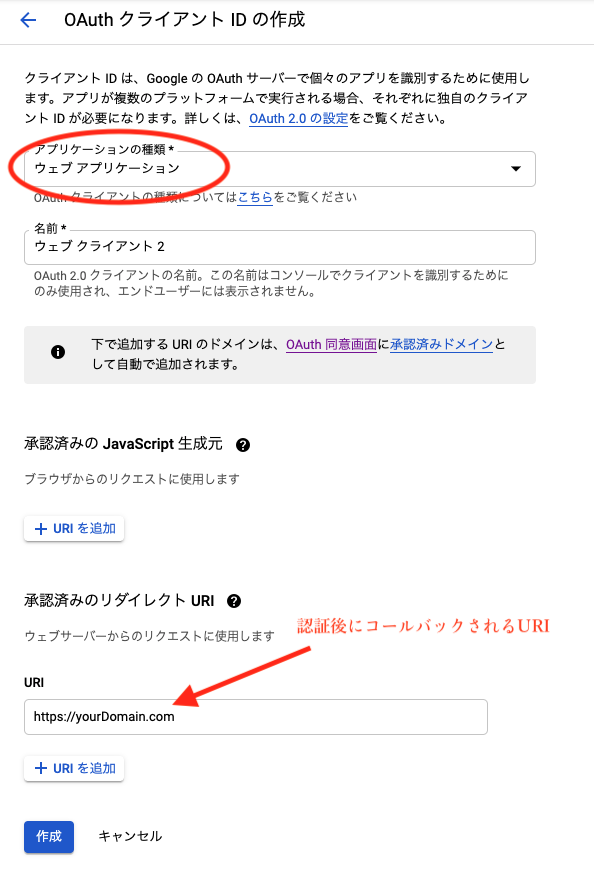
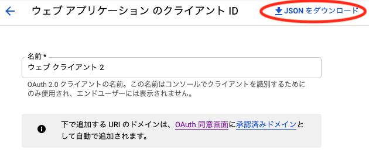

## 目的

LaravelでGoogle OAuth2.0認証をする。

## 使用環境

- Laravel (8.25.0)
- PHP (8.0.1)
- google/apiclient (2.0)

## 準備

- httpsサーバー(自己証明書は不可)

## 手順

1. ### OAuthクライアント作成

    [Google API コンソール](https://console.cloud.google.com/apis)へアクセスし、
    画面左側の認証情報画面から、「認証情報を作成」をクリックし、「OAuthクライアントID」を選択。

    

    アプリケーションの種類を「ウェブアプリケーション」にし、
    「承認済みのリダイレクト URI」に 認証後コールバックURIを入力してください。<br>
    入力したら保存をクリックし、OAuthクライアント作成してください。

    

    OAuthクライアント情報ページ上側の「JSONをダウンロード」をクリックし、JSONファイルをダウンロード。<br>
    (JSONファイルはLaravlプロジェクトのstorageフォルダに置いてください。)

    


2. ### OAuth2.0サーバーへリクエストを行うためのURLを生成

    Google Clientオブジェクトを作成します。<br>
    細かいオプションについては割愛します。詳しくは
    [OAuth2.0](https://developers.google.com/identity/protocols/oauth2/web-server#creatingclient)を参照してください。
    
    ```php
    //Google Clientオブジェクト作成
    $client = new Google_Client();
    $client->setAccessType('offline');  //オフライン時にアクセストークンを更新
    $client->setApprovalPrompt("force"); //承認プロンプトの動作（force: 承認UIを強制的に表示する）       
    $client->setScopes(Google_Service_Calendar::CALENDAR_READONLY); //スコープの設定        
    $client->setAuthConfig(storage_pat('***.json'));  //認証ファイルをstorage配下に設置
    ```

    次にOAuth認証ページのリクエストURLを生成しリダイレクトします。

    ```php
    $auth_url = $client->createAuthUrl();
    Redirect::to($auth_url)->send();
    ```

3. ### コールバック後の処理

    Google認証画面で認証後、OAuthクライアント作成時に設定したURIにリクエストされますので、
    リクエストパラメータの「code」から、アクセストークンとリフレッシュトークンを生成し、アクセストークンを設定します。<br>
    (リフレッシュトークンは DB や Session などで保存してください。)
    
    ```php
    $data = $this->client->fetchAccessTokenWithAuthCode($request->input('code'));            
    $this->client->setAccessToken(json_encode($data));  //アクセストークンはJSONで設定
    $refresh_token = $data['refresh_token'];

    //DBに取得したトークンを保存
    $user_model = Auth::user();
    $user_model->fill([
        'access_token' => $data,
        'refresh_token' => $refresh_token,
    ])->save();
    ```

    「fetchAccessTokenWithAuthCode」をすることで、このようなデータを取得できます。<br>
    ここで気をつけるべきは、アクセストークンの設定をトークン部分のみにすると、有効期限チェックでエラーが発生してしまうということです。<br>
    有効期限のチェックは expires_in を参照しているため、トークン部分のみだと「Undefined index: expires_in」とエラーが吐かれてしまいます。「fetchAccessTokenWithAuthCode」で取得したデータごとJSONに整形して設定しましょう。<br>
    (有効期限チェックをしない場合は、トークン部分のみでも可能です。)

    ```php
    array (
        'access_token' => 'ya29.A0AfH6SMAY1vO5I5xwYgD3kaxqA95zzbIKQXh1vuJ4p_vGCgY************',
        'expires_in' => 3599,
        'refresh_token' => '1//0eY_vMnUj5PEhCgYIARAAGA4SNwFg1CLVg*************',
        'scope' => 'https://www.googleapis.com/auth/calendar.readonly',
        'token_type' => 'Bearer',
        'created' => 1614699429,
    )
    ```

4. ### リフレッシュトークンからアクセストークンを更新

    アクセストークンは1時間ほどで有効期限が切れてしまうため、定期的にアクセストークンを更新する必要があります。
    保存しておいたリフレッシュトークンから、アクセストークンを取得します。<br>
    (例としてトークンはDBに保存します。)

    ```php
    // アクセストークンの有効期限を確認する (有効期限切れなら再取得して保存する)
    if ($this->client->isAccessTokenExpired()) {
        if (!is_null(Auth::user()->refresh_token)) {
            //リフレッシュトークンからアクセストークンを生成
            $access_token = $this->client->fetchAccessTokenWithRefreshToken(Auth::user()->refresh_token);
            Auth::user()->fill(['access_token' => $access_token])->save();  //DB更新
            $this->client->setAccessToken($access_token);  //アクセストークン設定
        }
    }
    ```
