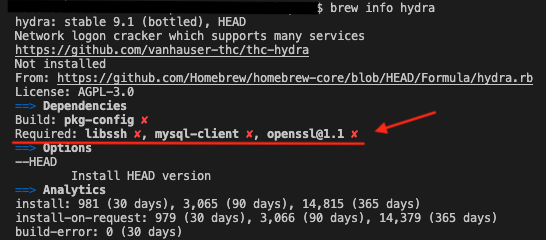
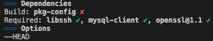
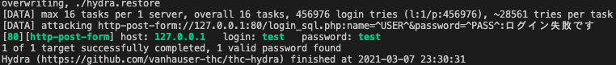

## 目的

hydraを使ってローカル環境のログインフォームにブルートフォース攻撃をし、脆弱性を確認する。

## 使用環境

- MAC
- MAMP
- hydra
- Homebrew

## hydraとは

hydraはパスワードクラック用のライブラリです。<br>
パスワードリストからブルートフォース攻撃をする際に用いられます。<br>
[公式GitHub](https://github.com/vanhauser-thc/thc-hydra)

## 手順

1. ### hydraのインストール

    hydraの依存関係をbrewコマンドで確認します。

    ```
    brew info hydra
    ```

    

    Requiredを確認すると、「libssh」「mysql-client」「openssh」が必須のようです。
    × マークがついていたらインストールしておきましょう。

    ```
    brew install libssh
    brew install mysql-client
    brew install openssh
    ```

    全てにチェックがついたらhydraをインストールします。
    

    ```
    brew install hydra
    ```

2. ### PHPでログインフォームの実装

    NAMEとPASSで認証をする、Basic認証のログインフォームをPHPで実装していきます。<br>
    例として、NAMEは「test」、PASSは「test」でMySqlに登録します。
    IDとPASSが一致すると「ログイン成功です」と表示されます。

    ```html
    <html>
        <head>
            <title>ログイン</title>
        </head>
        <body>
            <form action="login_sql.php" method="POST">
                ID: <input type="text" name="name">
                PASS: <input type="text" name="password">
                <input type="submit" value="login">
            </form>
        </body>
    </html>
    ```

    ```php
    <?php
    session_start();
    header('Content-Type: text/html; charset=UTF-8');
    $name = @$_POST['name'];
    $password = @$_POST['password'];

    try {
        $pdo = new PDO('mysql:dbname=hydra;host=localhost;charset=utf8','root','root');
        echo "接続成功\n";
        $sql = 'SELECT * FROM users WHERE name = :name and password = :password';
        // PDOStatementクラスのインスタンスを生成
        $prepare = $pdo->prepare($sql);
        $prepare->bindValue(':name', $name, PDO::PARAM_STR);
        $prepare->bindValue(':password', $password, PDO::PARAM_STR);
        // プリペアドステートメントを実行する
        $prepare->execute();
        // PDO::FETCH_ASSOCは、対応するカラム名にふられているものと同じキーを付けた 連想配列として取得します。
        $result = $prepare->fetchAll(PDO::FETCH_ASSOC);
    } catch (PDOException $e) {
        echo "接続失敗: " . $e->getMessage() . "\n";
        exit();
    }
    ?>

    <html>
    <body>
        <?php
            if(count($result) > 0){
                $_SESSION['id'] = $id;
                echo 'ログイン成功です';
            } else {
                echo 'ログイン失敗です';
            }
        ?>
    </body>
    </html>
    ```

3. ### hydraでデモ

    hydraで使うパスワードリストをcrunchコマンドで作っていきます。<br>
    デモなので桁数がわかっている体で、4文字の"aaaa"から"zzzz"のパスワードリストを生成しましょう。

    ```
    crunch 4 4 -o password.txt
    ```

    パスワードファイルが作られたら、それを使いhydraでブルートフォース攻撃をしかけます。

    ■hydraの基本構文

    ```
    hydra -l [ユーザ名] -P [パスワード辞書ファイル] [対象サーバ名/対象サーバIPアドレス] [http-get or ssh]
    ```

    今回はPOST通信でlocalhostに向けて攻撃しますので、それに合わせてコマンドを作り実行します。<br>
    詳しいオプションについては[hydra GitHub](https://github.com/vanhauser-thc/thc-hydra)を参考にしてください。

    ```
    hydra -l test -P password.txt 127.0.0.1 http-post-form '/login_sql.php:name=^USER^&password=^PASS^:ログイン失敗です'
    ```

    コマンドを実行するとパスワードリストの全てのパターンを先頭から実行していきます。
    パスワードが一致するとキャプチャのようにパスワードが出力されます。

    