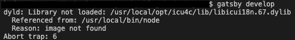
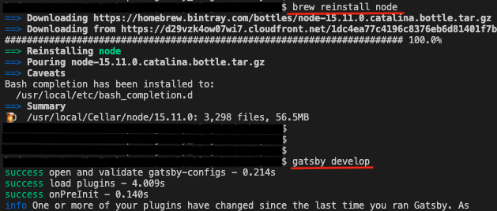

## 概要

gatsby developをしたらエラーが発生した。<br>
( dyld: Library not loaded: /usr/local/opt/icu4c/lib/libicui18n.67.dylib )<br>



エラー内容を調べたところ、依存関係の問題のよう。<br>
確かに直近でいくつかライブラリをインストールしており、その時に依存関係が崩れた可能性は考えられる🤔<br>
<br>
見たところ、Nodeを再インストールするかアップデートするかで直るみたいなので、Nodeを再インストールをしてみる。

```shell
brew reinstall node
```

再度gatsby develop をしたところ... お！直った！
