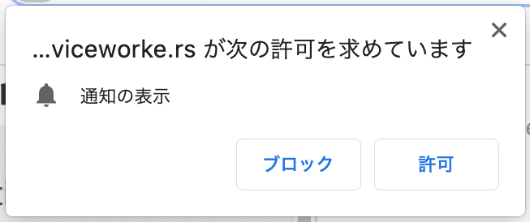
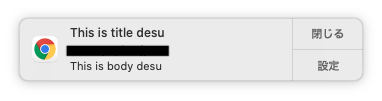

## 目的

Laravel + ReactでWebPush機能を実装する。

## 使用環境

- Laravel (8.22.1)
- React
- Httpsサーバー (自己証明書不可)
- [laravel-notification-channels/webpush](https://github.com/laravel-notification-channels/webpush)

## 手順

1. ### パッケージインストール

    composerを介して[laravel-notification-channels/webpush](https://github.com/laravel-notification-channels/webpush)をインストールしてください。<br>
    このパッケージを使用すると、Laravelを使用してWebプッシュ通知を簡単に送信できます。
    ```
    composer require laravel-notification-channels/webpush
    ```

    config/app.php のサービスプロバイダーに追加。
    ```php
    'providers' => [
        NotificationChannels\WebPush\WebPushServiceProvider::class,
    ],
    ```

    Userモデルに HasPushSubscriptions トレイトを追加し、プッシュ通知を送れるようにします。
    ```php
    use NotificationChannels\WebPush\HasPushSubscriptions;

    class User extends Model
    {
        use HasPushSubscriptions;
    }
    ```

2. ### DB準備
    インストールしたパッケージのコマンドからマイグレーションファイルを作成します。
    ```php
    php artisan vendor:publish --provider="NotificationChannels\WebPush\WebPushServiceProvider" --tag="migrations"
    ```

    /database/migrations配下に、***_create_push_subscriptions_table.php というマイグレーションファイルが作成されたことを確認してください。<br>
    確認したら、下記コマンドでテーブルを作成してください。
    ```
    php artisan migrate
    ```
    下記のようなテーブルが作成されます。

    ```
    mysql> desc push_subscriptions;
    +-------------------+---------------------+------+-----+---------------------+----------------+
    | Field             | Type                | Null | Key | Default             | Extra          |
    +-------------------+---------------------+------+-----+---------------------+----------------+
    | id                | bigint(20) unsigned | NO   | PRI | NULL                | auto_increment |
    | subscribable_type | varchar(255)        | NO   |     | NULL                |                |
    | subscribable_id   | bigint(20) unsigned | YES  |     | NULL                |                |
    | endpoint          | varchar(500)        | NO   | UNI | NULL                |                |
    | public_key        | varchar(255)        | YES  |     | NULL                |                |
    | auth_token        | varchar(255)        | YES  |     | NULL                |                |
    | content_encoding  | varchar(255)        | YES  |     | NULL                |                |
    | created_at        | timestamp           | NO   |     | 0000-00-00 00:00:00 |                |
    | updated_at        | timestamp           | NO   |     | 0000-00-00 00:00:00 |                |
    +-------------------+---------------------+------+-----+---------------------+----------------+
    9 rows in set (0.00 sec)
    ```

3. ### VAPID作成
    次のコマンドを使用してVAPIDキー（ブラウザー認証に必要）を生成します。
    ```
    php artisan webpush:vapid
    ```

    コマンドを実行すると、VAPID_PUBLIC_KEY と VAPID_PRIVATE_KEY が.envに追加されます。
    ```
    VAPID_PUBLIC_KEY=*********
    VAPID_PRIVATE_KEY=*********
    ```

    次に、configファイルを生成します。
    ```php
    php artisan vendor:publish --provider="NotificationChannels\WebPush\WebPushServiceProvider" --tag="config"
    ```

4. ### Laravel側の実装

    #### サブスクリプションの保存/更新
    フロントから送られてくるエンドポイントと認証情報を登録する処理を実装します。<br>
    ($keyと$tokenは、通知を暗号化するために使用されています。)

    ```php
    // ~~ 省略 ~~
    public function subscription(Request $request)
    {
        $user = \Auth::user();
        $endpoint = $request->endpoint;
        $key = $request->key;
        $token = $request->token;
        // updatePushSubscription($endpoint, $key = null, $token = null, $contentEncoding = null)
        $user->updatePushSubscription($endpoint, $key, $token);
        return ['result' => true];
    }
    ```

    ルーティングにも追加してください。
    ```php
    Route::post('/subscription', 'AppController@subscription')->name('subscription');
    ```

    #### Notificationの登録
    Web Push用のNotificationクラスを実装していきます。
    下記コマンドで app/Notifications/webPushEvent.php というファイルが作成されます。
    ```
    php artisan make:notification webPushEvent
    ```

    ```php
    <?php
    namespace App\Notifications;
    use Illuminate\Notifications\Notification;
    use NotificationChannels\WebPush\WebPushChannel;
    use NotificationChannels\WebPush\WebPushMessage;

    class webPushEvent extends Notification
    {
        public function via($notifiable)
        {
            return [WebPushChannel::class];
        }

        public function toWebPush($notifiable, $notification)
        {
            return (new WebPushMessage)
                ->title('This is title desu')
                ->body('This is body desu');
        }
    }
    ```

5. ### React側の実装

    アクセス後下記のようにプッシュ通知の許可を求め、許可をした場合に Service Worker をインストールし、
    認証情報とエンドポイントを先ほど実装した /subscription に送信する処理を実装します。
    

    先ほど作成した VAPID をheadに追加してください。
    ```html
    <meta name="vapidPublicKey" content="{{ config('webpush.VAPID_PUBLIC_KEY') }}">
    ```

    ```javascript
    import React from 'react';

    export default function WebPush(props) {

        // サービスワーカーが使えない系では何もしない
        if ('serviceWorker' in navigator) {
            console.log('service worker サポート対象');
            // サービスワーカーとして、public/sw.js を登録する
            navigator.serviceWorker.register('sw.js')
            .then(function (registration) {
                initialiseServiceWorker();
            })
            .catch(function(error) {
                console.error('Service Worker Error', error)
            })
        } else {
            console.log('service worker サポート対象外');
        }
        /**
         * サービスワーカーを初期化する
         * 初期化では、プッシュ通知用の情報をサーバに送る
         */
        function initialiseServiceWorker() {
            if (!('showNotification' in ServiceWorkerRegistration.prototype)) {
                console.log('cant use notification')
                return
            }
            if (Notification.permission === 'denied') {
                console.log('user block notification')
                return
            }
            if (!('PushManager' in window)) {
                consoleo.log('push messaging not supported')
                return
            }
            // プッシュ通知使えるので
            navigator.serviceWorker.ready.then(registration => {
                registration.pushManager.getSubscription()
                .then(subscription => {
                    if (! subscription) {
                        subscribe(registration)
                    }
                })
            })
        }
        /**
         * サーバに自身の情報を送付し、プッシュ通知を送れるようにする
         */
        function subscribe(registration) {
            var options = { userVisibleOnly: true }
            //公開鍵をheadに仕込んで取得
            var vapidPublicKey = document.head.querySelector('meta[name="vapidPublicKey"]').content;
            if (vapidPublicKey) {
                options.applicationServerKey = urlBase64ToUint8Array(vapidPublicKey)
            }
            registration.pushManager.subscribe(options)
            .then(subscription => {
                updateSubscription(subscription)
            })
        }
        /**
         * 購読情報を更新する
         *
         */
        function updateSubscription(subscription) {
            var key = subscription.getKey('p256dh')
            var token = subscription.getKey('auth')
            var data = new FormData()
            data.append('endpoint', subscription.endpoint)
            data.append('key', key ? btoa(String.fromCharCode.apply(null, new Uint8Array(key))) : null),
            data.append('token', token ? btoa(String.fromCharCode.apply(null, new Uint8Array(token))) : null)
            // サーバに認証情報とエンドポイントを渡す
            fetch('/subscription', {
                method: 'POST',
                body: data,
            }).then(() => console.log('Subscription ended'))
        }

        function urlBase64ToUint8Array (base64String) {
            var padding = '='.repeat((4 - base64String.length % 4) % 4);
            var base64 = (base64String + padding)
            .replace(/\-/g, '+')
            .replace(/_/g, '/')
            var rawData = window.atob(base64)
            var outputArray = new Uint8Array(rawData.length)
            for (var i = 0; i < rawData.length; ++i) {
                outputArray[i] = rawData.charCodeAt(i)
            }
            return outputArray
        }

        return <div></div>
    }
    ```

6. ### Service Workerの登録
    [Service Worker](https://developers.google.com/web/fundamentals/primers/service-workers?hl=ja)は、
    Webの裏側で動く独立したJavaScript環境です。<br>
    Laravelプロジェクトの public/sw.jsに Service Worker本体を実装していきます。

    ```javascript
    // インストールされたら
    self.addEventListener('install', function (e) {
        console.log('ServiceWorker install')
    })

    // アクティブ化したら
    self.addEventListener('activate', function (e) {
        console.log('Serviceworker activated')
    })

    const WebPush = {
        init() {
            self.addEventListener('push', this.notificationPush.bind(this))  //pushが来る
            self.addEventListener('notificationclick', this.notificationClick.bind(this))  //通知をクリックする
        },
        notificationPush(event) {
            if (!(self.Notification && self.Notification.permission === 'granted')) {
                return
            }
            if (event.data) {
                event.waitUntil(
                    this.sendNotification(event.data.json())
                )
            }
        },
        notificationClick(event) {
            console.log('Serviceworker clicked')
        },
        
        sendNotification(data) {
            //プッシュ通知のタイトルとスタイルを指定
            options = {};
            return self.registration.showNotification(data.title, options)
        },
    }

    WebPush.init()
    ```
   
    上記ではService Workerをインストール・アクティブ化した際の処理と、プッシュ通知をクリックした際の処理を実装しています。
    プッシュ通知のスタイル(アイコン画像など)は、[showNotification](https://developer.mozilla.org/ja/docs/Web/API/ServiceWorkerRegistration/showNotification)メソッドで指定することができます。<br>
    <br>
    余談ですが、Service Workerは、独立したJavaScript環境であるため、Reactアプリとの連携は原則できません。<br>
    データの受け渡しが必要な場合は、indexeddb を使用することで可能となります。

7. ### 動作検証

   全ユーザーにプッシュ通知をする機能を実装してみます。<br>
   下記コードをルートに追加し https://******/test にアクセスしてみてください。<br>
   Userテーブルに登録されているユーザーの中で、push_subscriptions テーブルにも登録されているユーザーにプッシュ通知されます。

    ```php
    Route::get('test', function(){
        $users = User::all();
        foreach($users as $user){
            $user->notify(new EventAdded());
        }
    });
    ```

    下のようなプッシュ通知が飛んでくれば成功です！

    

## 終わり

ここまでお疲れ様でした。<br>
今回の記事はLaravel + Reactで WebPush機能を実装してみようという内容でした。<br>
今回使ったService Workerですが、WebPush以外にも多くの面白い機能がありますので、
そちらも記事にしていけたらなと思います。
