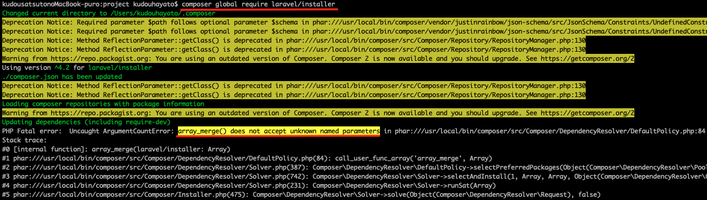
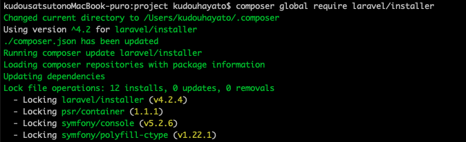

## array_merge() does not accept unknown named parameters

```
composer global require laravel/installer
```

Laravelのインストーラーをcomposerでインストールしようとしたところ、このようなエラーが発生。<br>
調べてみたところ、PHP8系 + Composer1系で発生している問題のようです。<br>
<br>
ということでPHPのバージョンを下げるか、Composerのバージョンを上げると解決されます。<br>
PHPのバージョンは依存関係が面倒なので、今回はComposerのバージョンを上げてみます。

```
composer self-update
```

インストールできました✌️
