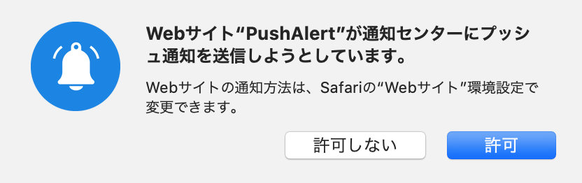

## 目的

ユーザーがプッシュ通知を受信する許可を求められると、SafariはWebサーバーにパッケージを要求します。
リクエストを受信したwebサーバーは規約に乗っ取り、zipファイルを作成しブラウザに返却します。<br>
<br>
そのzipファイルの作成手順が複雑で、詳細な情報が
[公式ドキュメント](https://developer.apple.com/library/archive/documentation/NetworkingInternet/Conceptual/NotificationProgrammingGuideForWebsites/PushNotifications/PushNotifications.html)
に記載されていなかったのでまとめておきます。<br>
<br>
証明書ファイルと鍵ファイル・プッシュIDが手元にある体で解説します。まだ作成されていない場合は[プッシュ通知に必要な証明書の作り方2021](https://qiita.com/natsumo/items/d5cc1d0be427ca3af1cb)
などを参考にしてください。

## 使用環境

- Laravel
- safari
- Httpsサーバー
- [jwage/php-apns](https://github.com/jwage/php-apns) (プッシュバッケージの作成に使用)

## 手順

1. ### safariからwebサーバーにパッケージを要求

「window.safari.pushNotification.requestPermission」でユーザープッシュ通知を送信する許可を要求します。

```javascript
const websitePushID = 'webサイトpush ID';
const webServiceUrl = location.href + 'safari_push_notifications';  // プッシュパッケージを作成するURL
var permissionData = {};

var checkRemotePermission = function (permissionData) {
    if (permissionData.permission === 'default') {
        try {
            window.safari.pushNotification.requestPermission(
                webServiceUrl,
                websitePushID,
                {userToken: ***}, // ユーザー識別
                checkRemotePermission
            );
        } catch (e) {
            console.log(e);
        }
    }
    else if (permissionData.permission === 'denied') {
        console.log('ブロックされました')
    }
    else if (permissionData.permission === 'granted') {
        // deviceTokenの取得
        var data = new FormData()
        data.append('deviceToken', permissionData.deviceToken)
        fetch('/safari_push_notifications/registerAction', {
            method: 'POST',
            body: data,
        }).then(() => console.log('サブスクリプションが終了しました'))
    }
};

//ユーザーがSafariプッシュ通知を受信できることを確認
if ('safari' in window && 'pushNotification' in window.safari) {
    permissionData = window.safari.pushNotification.permission(websitePushID);
    checkRemotePermission(permissionData);
} else {
    console.log('サポート対象外')
}
```

2. ### Laravelのルーティングの設定

csrfを無効化したいので api.php にルーティングしていきます。<br>
web.phpでルーティングしたい場合はcsrf対策をしてください。

```php
Route::post('/safari_push_notifications/v2/pushPackages/{プッシュID}', 'SafariPushNotificationsController@createPackage');
Route::post('/safari_push_notifications/v1/log', 'SafariPushNotificationsController@getLog');
```

※任意<br>
デフォルトだと URLに /api がついてしまうので app/Providers/RouteServiceProvider の prefix を削除してください。

```php
Route::middleware('api')
// ->prefix('api')
->domain($domain)
->namespace($this->namespace)
->group(base_path('routes/api.php'));
```

3. ### プッシュパッケージの作成

「window.safari.pushNotification.requestPermission」でプッシュ通知の許可をPOSTすると、次のURLにリクエストが送信されます。<br>

```
webServiceURL/version/pushPackages/websitePushID
```

リクエストを受信したら、.p12証明書ファイルを元に、アイコンやマニフェストをまとめたzipファイルを生成します。<br>
フルスクラッチで実装するのは大変なので、[jwage/php-apns](https://github.com/jwage/php-apns)を使って実装します。<br>
証明書ファイルは /storage/app 配下に置いてください。

```
composer require jwage/php-apns
```

インストールしたら /vendor/jwage/php-apns/data/safariPushPackage.base のアイコンファイルとマニフェストファイルを
Laravelプロジェクトの /storage/app 配下に置いてください。

```php
use JWage\APNS\Certificate;
use JWage\APNS\Safari\PackageGenerator;

class SafariPushNotificationsController
{
    public function createPackage(Request $request)
    {
        // Safariがユーザーに通知を送信する許可を求めたときに、プッシュ通知パッケージをブラウザーに送信
        $certificate = new Certificate(file_get_contents(storage_path('webpush.p12')), 'kudou'); // .p12証明書を元にzipファイルを生成
        $packageGenerator = new PackageGenerator(
            $certificate,
            storage_path('app'),  // zipファイルの作成場所
            request()->getHttpHost()
        );

        // userToken: ユーザーの識別トークン
        $package = $packageGenerator->createPushPackageForUser($request->userToken);
        $contents = file_get_contents($package->getZipPath());
        echo $contents;
    }
```

zipファイルが正常にsafariに渡されると、プッシュ通知の許可ポップアップが表示されます。



4. ### エラーログの取得

エラーが発生した場合、次のURLにリクエストが送信されます。<br>
エラー内容はリクエストに含まれているので、ログに表示します。

```
webServiceURL/version/log
```

```php
Route::post('/safari_push_notifications/v1/log', 'SafariPushNotificationsController@getLog');
```
考えられるエラーリストについては、
[トラブルシューティング ](https://developer.apple.com/library/archive/documentation/NetworkingInternet/Conceptual/NotificationProgrammingGuideForWebsites/PushNotifications/NaN#//apple_ref/doc/uid/TP40013225-CH3-SW17)
を参照してください。

```php
class SafariPushNotificationsController
{
    // ログの表示
    public function getLog(Request $request)
    {
        Log::debug($request);
    }
```
