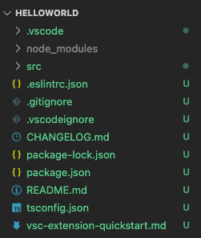
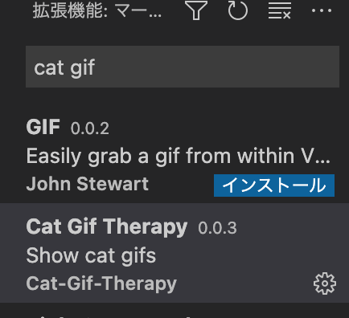
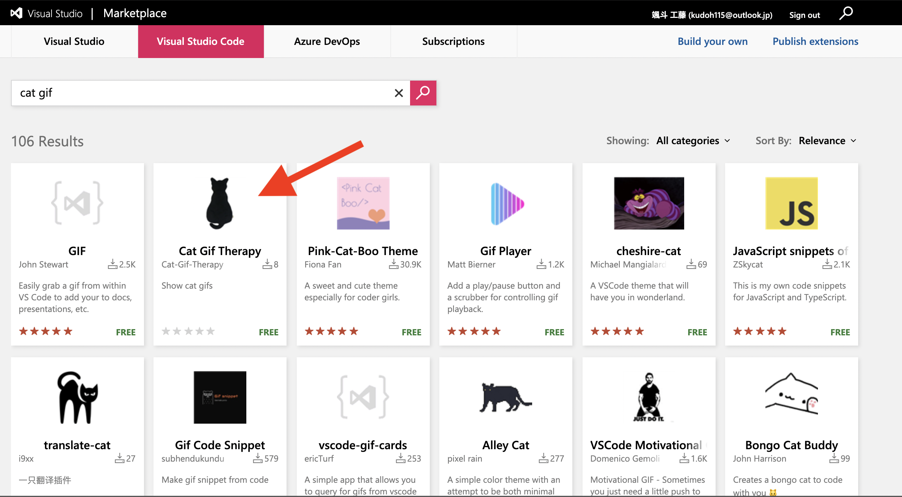

本記事では、VSCode拡張機能を開発する環境の構築手順を解説していきます。

### 開発環境
・Node.js<br>
・npm<br>
・Yeoman<br>
・VS Code ExtensionGenerator<br>

## プロジェクト準備

### ジェネレータからプロジェクト作成

vscodeジェネレータを使用しプロジェクトの雛形を作成します。<br>
[Yeoman](https://yeoman.io)と[VS Code ExtensionGenerator](https://www.npmjs.com/package/generator-code)をnpmでインストールしてください。

```shell
npm install -g yo generator-code
```

インストールしたらジェネレータを実行しプロジェクトを作成します。<br>


```shell
$ yo code
yo code

     _-----_     ╭──────────────────────────╮
    |       |    │   Welcome to the Visual  │
    |--(o)--|    │   Studio Code Extension  │
   `---------´   │        generator!        │
    ( _´U`_ )    ╰──────────────────────────╯
    /___A___\   /
     |  ~  |     
   __'.___.'__   
 ´   `  |° ´ Y ` 

? What type of extension do you want to create? New Extension (TypeScript)
? What's the name of your extension? HelloWorld
? What's the identifier of your extension? helloworld
? What's the description of your extension? My first extension
? Initialize a git repository? Yes
? Bundle the source code with webpack? No
? Which package manager to use? npm

Writing in /Users/yucchiy/helloworld...
   create .vscode/extensions.json
   create .vscode/launch.json
   create .vscode/settings.json
   create .vscode/tasks.json
   create src/test/runTest.ts
```

- ### ? What type of extension do you want to create? **New Extension (TypeScript)**
    - ベースとなる言語の選択をします。
    - 今回は TypeScript を使用するため、**New Extension (TypeScript)**を選択しますが、JavaScriptでの開発も可能です。

- ### ? What's the name of your extension? **HelloWorld**
    - [Marketplace](https://marketplace.visualstudio.com/vscode)やVSCodeからの検索で表示される、拡張機能の名前です。
    - package.jsonで後から変更可能です。

- ### ? What's the identifier of your extension? **helloworld**
    - 拡張機能のIDです。

- ### ? What's the description of your extension? **My first extension**
    - 拡張機能の説明です。package.jsonで後から変更可能です。

- ### ? Initialize a git repository? **Yes**
    - gitリポジトリの初期化をするかの質問です。

- ### ? Bundle the source code with webpack? **No**
    - Webpackでバンドルするかの質問です。
    - yes にした場合 webpack.config.js が生成されます。

- ### ? Which package manager to use? **npm**
  - パッケージマネージャーを npm か yarn のどちらかにするかの質問です。

<br>
下のような構造のプロジェクトが作成されたら成功です。



## プロジェクト実行

VSCodeエディタ内で **F5(macだとF5+fn)**を押すと、拡張機能がコンパイルされ、新しいウィドウで**拡張機能開発ホスト**が立ち上がります。<br>
ジェネレータで作成した場合、最初から簡単な機能が組み込まれています。コマンドパレットで**Hello World**と入力すると、**Hello World from HelloWorld!**とメッセージが出力されます。

<video autoplay="" loop="" muted="" playsinline="" controls="" title="Launch your first VS Code extension video" style="width: 100%;">
  <source src="https://code.visualstudio.com/api/get-started/your-first-extension/launch.mp4" type="video/mp4"> 
</video>


## 補足

### 補足1: サンプルからプロジェクト作成
[vscode拡張サンプル集](https://github.com/microsoft/vscode-extension-samples)をクローンし、サンプルからプロジェクトを作成する方法もあります。<br>
クローンしたら、codeコマンドでディレクトリを展開し、プロジェクトを開きます。<br>
その後、VSCodeエディタ内で **F5(macだとF5+fn)** を実行してください。拡張機能開発ホストでサンプルが実行されます。<br>
<br>
ドキュメント読んでもイメージが湧かないって時なんかに重宝します。

```shell
git clone https://github.com/Microsoft/vscode-extension-samples
code <使用したいフォルダ名>
npm install
```

### 補足2: package.json の構造

実際に公開しているパッケージを例にするとこのような感じです。<br>
([Cat Gif Therapy](https://marketplace.visualstudio.com/items?itemName=CatTherapy.vscode-cat-therapy): 猫のGIFを出力する拡張機能です。良かったら使ってください!)<br>

```php
{
	"name": "vscode-cat-therapy", // 拡張子の名前にあたり、サブタイトル的役割をします
	"displayName": "Cat Gif Therapy", // マーケットプレイスで使用される拡張機能の表示名
	"description": "Show cat gifs", // 機能についての簡単な説明
	"icon": "cat.jpg", // マーケットプレイスで使用されるアイコン画像
  ~~ 以下略 ~~
```

package.jsonの詳しい内容については[公式ドキュメント](https://code.visualstudio.com/api/references/extension-manifest)をご参照ください。

* VSCodeエディタからの検索


* [Marketplace](https://marketplace.visualstudio.com/)からの検索
