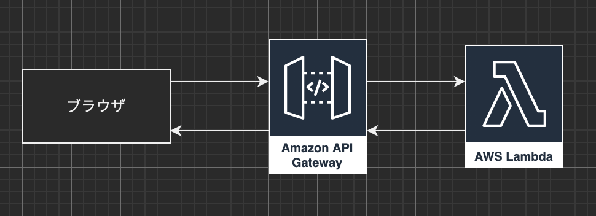

### 準備

IBM Watsonの設定が完了し、下記が取得できている前提で解説します。
- API KEY
- API URL
- API VERSION

### 完成図

メンテナンス中ですが、IBM Watsonで動作しているチャットボット(?)です。[DEMO](/other/yukari)<br>
<br>
全体の流れとしては、ブラウザでユーザーが会話内容を入力し、API GatewayにPOSTします。<br>
POSTされたAPI Gatewayは、設定したLambda関数を呼び出し、会話データを渡します。<br>
呼び出されたLambdaはIBM Watsonで適切な会話文を生成し、レスポンスします。


下記が全体のコードで、Lambdaの関数ハンドラーはデフォルトの lambda_handler とし、textキーに判定したい文字列を含め、lambdaにリクエストしています。

```python
import json
import requests

watson_ass_key="*****uWGqxfx1HCrSna0Vuw_j*******"
watson_ass_url="https://api.jp-tok.assistant.watson.cloud.ibm.com/instances/*****/v2/assistants/******/sessions"
watson_api_ver="2021-06-14"

def lambda_handler(event, context):
    text = event["text"]
    session_id = getSessionWt()
    res = sendMessagenWt(session_id, text)
    deleteSessionWt(session_id)
    return json.dumps(res, ensure_ascii=False)

# セッション取得
def getSessionWt():
    url = watson_ass_url+"?version="+watson_api_ver
    response = requests.post(url, auth=('apikey', watson_ass_key))
    resp_dict = response.json()
    return resp_dict['session_id']

# セッション削除        
def deleteSessionWt(sessionID):
    url = watson_ass_url+'/'+sessionID+"?version="+watson_api_ver
    response = requests.delete(url, auth=('apikey', watson_ass_key))
        
# メッセージ取得
def sendMessagenWt(sessionID, text):
    url = watson_ass_url+'/'+sessionID+"/message?version="+watson_api_ver
    headers = {'content-type': 'application/json'}
    item_data = {'input': {'text': text}}
    response = requests.post(url, json=item_data, headers=headers, auth=('apikey', watson_ass_key))
    watsonResult = response.json()
    watsonTexts = watsonResult['output']['generic']
```

### 解説

1. セッションID発行

会話セッションを開始するため、セッションIDを発行します。<br>
今回は requests メソッドを使用していますが、HTTPリクエストできれば他のメソッドを使用してもOKです。<br>
<br>
注意: Lambdaには requests がデフォルトは入っていないです。下記を参考にしてください。<br>
[【Lambda】import requests が使えるようにする【python】](https://qiita.com/afukuma/items/b7191025700a7829967c)


```python
# セッション取得
def getSessionWt():
    url = watson_ass_url+"?version="+watson_api_ver
    response = requests.post(url, auth=('apikey', watson_ass_key))
    resp_dict = response.json()
    return resp_dict['session_id']
```

2. メッセージ送信

先ほど取得したセッションIDをパラメータに含めリクエストします。<br>
リクエストbodyにはコードと同じキーで送信してください。<br>
IBM Watsonで生成されたデータがレスポンスされます。

```python
def sendMessagenWt(sessionID, text):
    url = watson_ass_url+'/'+sessionID+"/message?version="+watson_api_ver
    headers = {'content-type': 'application/json'}
    item_data = {'input': {'text': text}}
    response = requests.post(url, json=item_data, headers=headers, auth=('apikey', watson_ass_key))
    watsonResult = response.json()
    watsonTexts = watsonResult['output']['generic']
```

3. セッションID削除

発行したセッションIDをパラメータに含めリクエストします。<br>
deleteメソッドでリクエストしていることに注意してください。

```python
# セッション削除        
def deleteSessionWt(sessionID):
    url = watson_ass_url+'/'+sessionID+"?version="+watson_api_ver
    response = requests.delete(url, auth=('apikey', watson_ass_key))
```