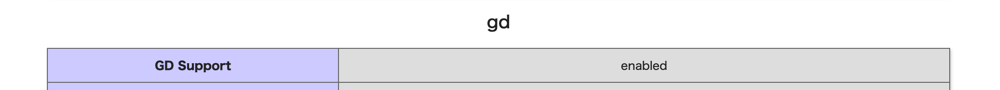

Laravelで画像を編集する場合、[InterventionImage](http://image.intervention.io/)を使用することで、PHP GDより簡単でシンプルに実装することができます。
しかし環境によっては、パッケージを使用することができない場合や、PHP GDを使用することでメモリの消費を下げたい場合もあると思います。<br>
昨今のサーバでは PHP GD がデフォルトで有効化されている場合が多いため、PHP GDでの画像編集方法をご紹介します。

## 1. PHP GDが有効になっているか確認

phpinfo で GD Support が enable になっていることを確認してください。<br>
コマンドから確認する方法と phpinfo から確認する方法を紹介します。

■ コマンドで確認
```php
php -i | grep -Ei '^(gd|imagic|gmagic)' | grep enabled
GD Support => enabled
```

■ phpinfoで確認
```php
phpinfo();
```



項目がない、もしくは enabled 以外になっていた場合、GDライブラリが入っていないか、有効化されていない可能性があります。<br>
[PHPのGDライブラリが有効になっていない時の対処法](https://live-cast.asia/blog/2020/12/php-gd-enable-method.html/)などを参考に前もって有効化してください。

## 2. キャッシュの確認

画像のリサイズはメモリを多く消費するため、何度も同じ画像をリサイズする場合、リサイズした画像をキャッシュ化した方が良い場合もあります。
そのため、キャッシュが存在する場合はキャッシュした画像を返し、キャッシュが存在しない場合は新たにリサイズした画像を返すような設計します。<br>
<br>
キャッシュの存在確認は、ファイル名のハッシュがキャッシュに存在するかで判断します。<br>
(キャッシュの作成については後で解説します。)

```php
function getFilePath(){
    $hash = $this->getHash($path_parts['basename']); // ファイル名でキャッシュ作成
    $cache = \Cache::get($hash);

    if($cache && file_exists(storage_path('app/public/cache/'.$cache))) {
        $file_path = storage_path('app/public/cache/'.$cache);
    } else {
        $file_path = $this->cacheImage($file_path, $hash, $path_parts['basename']);
    }
    return $file_path;
}

function getHash($string) {
    return sha1($string);
}
```

## 3. 関数の呼び出し / キャッシュセット

$maxWidthで、リサイズ後の最大横幅、$maxHeightで最大縦幅を指定し、リサイズ処理関数を呼び出します。<br>
リサイズ後はファイル名をハッシュ化しキャッシュにセットしています。

```php
function cacheImage($imageUrl, $hash, $fileName)
{
    $maxWidth = 1000;
    $maxHeight = 1000;
    list($originalWidth, $originalHeight) = getimagesize($imageUrl);
    list($canvasWidth, $canvasHeight) = $this->getContainSize($originalWidth, $originalHeight, $maxWidth, $maxHeight);
    $resized_image_path = $this->transformImageSize($imageUrl, $canvasWidth, $canvasHeight);
    \Cache::put($hash, $fileName); // ファイル名でキャッシュ
    return $resized_image_path;
}
```

## 4. リサイズ

getContainSize()では、指定した最大幅を超えない範囲で縦横比を維持した最大値をタプルで返しています。<br>
transformImageSize()では、指定したサイズの新しい画像オブジェクトを作成し、元画像を描画します。<br>

```php
// 内接サイズを計算
function getContainSize($width, $height, $containerWidth, $containerHeight)
{
    $ratio = $width / $height;
    $containerRatio = $containerWidth / $containerHeight;
    if ($ratio > $containerRatio) {
        return [$containerWidth, intval($containerWidth / $ratio)];
    } else {
        return [intval($containerHeight * $ratio), $containerHeight];
    }
}

// 画像のサイズを変形して保存
function transformImageSize($srcPath, $width, $height)
{
    list($originalWidth, $originalHeight, $type) = getimagesize($srcPath);
    $path_parts = pathinfo($srcPath);
    $canvas = imagecreatetruecolor($width, $height);

    switch ($type) {
        case IMAGETYPE_JPEG:
            $source = imagecreatefromjpeg($srcPath); //元の画像を読み込む
            break;
        case IMAGETYPE_PNG:
            $source = imagecreatefrompng($srcPath);
            break;
        default:
            Log::error("サポートしていない画像形式です: $type");
            exit;
    }

    imagecopyresampled($canvas, $source, 0, 0, 0, 0, $width, $height, $originalWidth, $originalHeight);
    imagejpeg($canvas, storage_path('app/public/cache/'.$path_parts['basename'])); // キャッシュ画像を保存
    imagedestroy($source); // メモリ解放
    imagedestroy($canvas);
    return storage_path('app/public/cache/'.$path_parts['basename']);
}
```