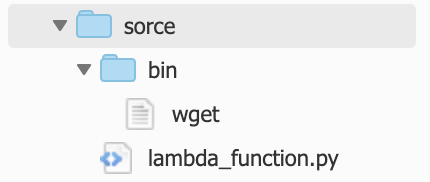
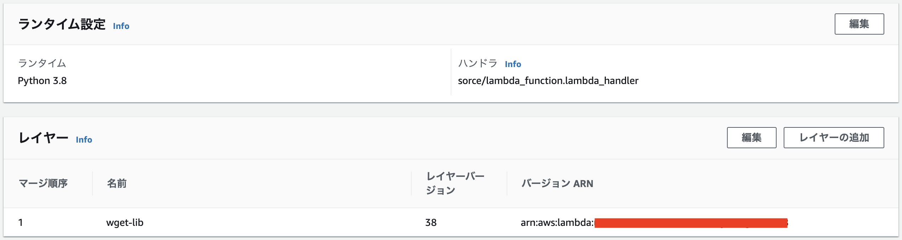
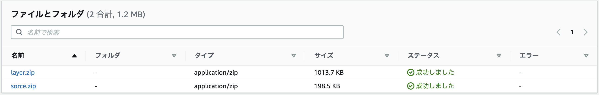

### 背景

Lambda上でwgetコマンドを実行する必要がありましたが、Lambdaにはデフォルトでwgetコマンドはインストールされておらず、手動でコマンドバイナリをアップロードする必要がありました。<br>
また、コマンドを使用する上で、共有ライブラリとなる Shared Object もアップロードする必要があり、やや複雑化してしまったため、Cloud Formationで自動化することにしました。

### 完成図

■ Lambdaディレクトリ構造


■ ランタイム/レイヤー設定


### 1. S3にファイルをアップロード

Lambdaのソースコードはzip化することをオススメします。<br>
zip化したファイルは S3 にアップロードすることで CloudFormation からアクセスすることができます。<br>
<br>
画像のように shared object(layer.zip)と ソースコード + コマンドバイナリ(sorce.zip) をS3にアップロードしてください。



**補足:**<br>
テンプレートファイルにソースをインラインで含めることもできます。(ZipFile)<br>
ソースコードは最大4096文字で、JSONの場合、エスケープ処理の必要があることに注意してください。<br>
[AWS::Lambda::Function Code](https://docs.aws.amazon.com/ja_jp/AWSCloudFormation/latest/UserGuide/aws-properties-lambda-function-code.html)<br>


### 2. テンプレートファイル作成

Lambda作成にあたり、Roleの指定は必須となっています。[AWS::Lambda::Function](https://docs.aws.amazon.com/ja_jp/AWSCloudFormation/latest/UserGuide/aws-resource-lambda-function.html#cfn-lambda-function-code)<br>
そのため、Lambda用に CloudWatch の操作権限のみ付与したIAMロールを作成をしています。<br>
<br>
(IAMロール作成には AssumeRole を使用しています。AssumeRoleの説明は下記がわかりやすいです。)<br>
> [IAM ロールの PassRole と AssumeRole をもう二度と忘れないために絵を描いてみた](https://dev.classmethod.jp/articles/iam-role-passrole-assumerole/)
<br>

また、ソースをzip化した関係上、実行ファイルの上にディレクトリが来てしまい、デフォルトでは実行関数の指定ができません。<br>
Lambdaランタイム設定のハンドラーを **「ディレクトリ/ファイル名.関数名」** にすることで実行関数の指定ができます。

```yml
AWSTemplateFormatVersion: "2010-09-09"
Description: Lambda(Layer + Handler File + Command Package)

Parameters: # ユーザ定義
# 見やすさ重視のため、入力値はリソース定義に記載しました。

Resources: # AWSリソース定義

    # Lambda Create
    Lambda:
        Type: AWS::Lambda::Function
        Properties:
            Code:
                S3Bucket: "lambda-source-bucket"
                S3Key: "sorce.zip"
            Layers:
                - !Ref LambdaLayer
            FunctionName: "MyLambda"
            Handler: "sorce/lambda_function.lambda_handler"
            Runtime: python3.8
            Timeout: 60
            MemorySize: 128
            Role: !GetAtt LambdaExecutionRole.Arn

    # Lambda Layer Create
    LambdaLayer:
        Type: "AWS::Lambda::LayerVersion"
        Properties:
            CompatibleRuntimes:
                - python3.8
            Content:
                S3Bucket: "lambda-source-bucket"
                S3Key: "layer.zip"
            LayerName: "wget-lib"

    # Lambda Role Create
    LambdaExecutionRole:
        Type: AWS::IAM::Role
        Properties:
            AssumeRolePolicyDocument:
                Version: "2012-10-17"
                Statement:
                    - Effect: Allow
                      Principal:
                          Service:
                              - "lambda.amazonaws.com"
                      Action:
                          - sts:AssumeRole
            Policies:
                - PolicyName: allowLambdaLogs
                  PolicyDocument:
                      Version: "2012-10-17"
                      Statement:
                          - Effect: Allow
                            Action:
                                - logs:*
                            Resource: arn:aws:logs:*:*:*
```